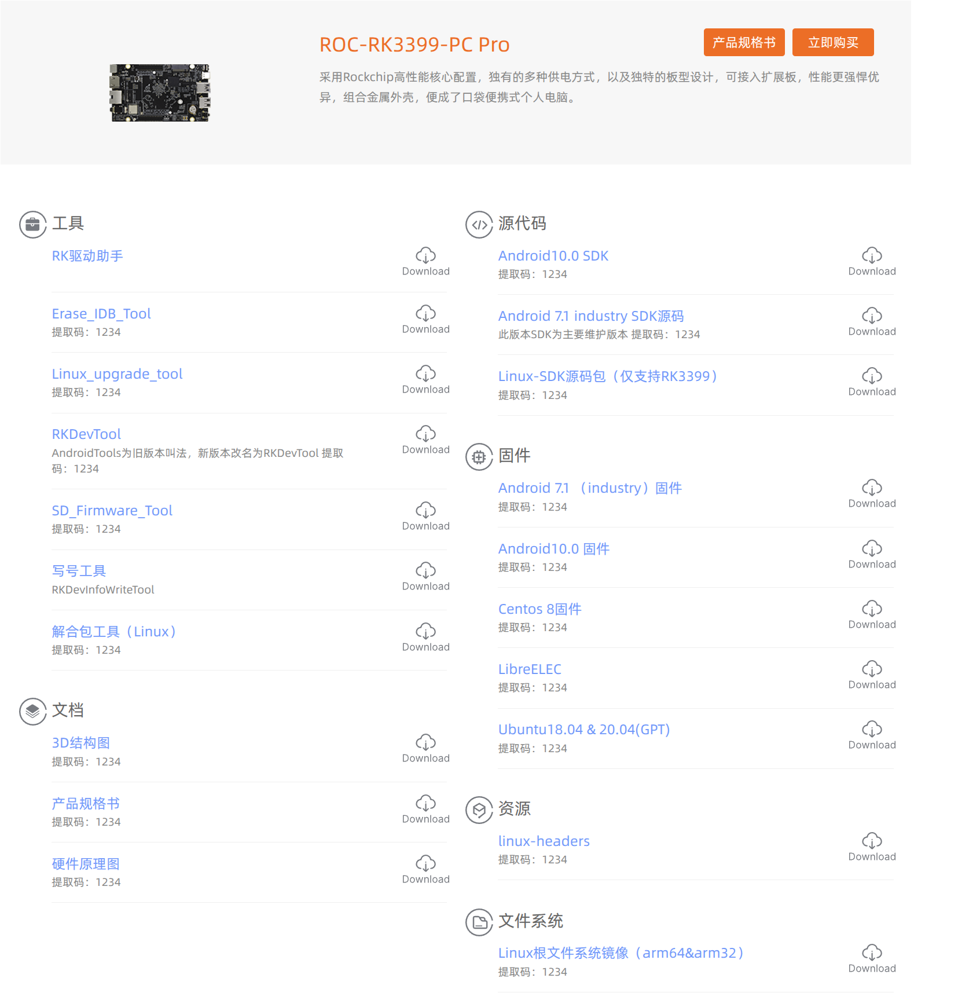
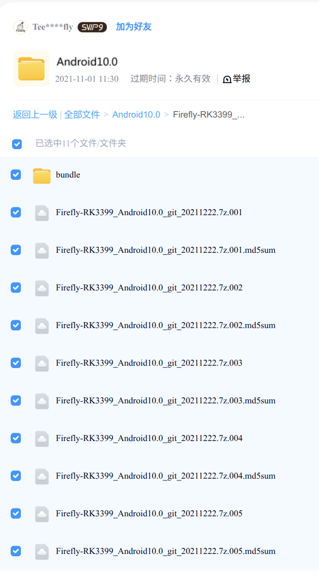

## 源码
解决从哪里下载，下载什么，如何合并以及打开的问题。

### 下载地址：

[ROC-RK3399-PC Pro资源下载](https://www.t-firefly.com/doc/download/145.html)



#### Android 10源码目录结构说明


Android10的源码，采用`Git Bundle`分包存储，方便大文件传输。


1. `bundle` 文件夹，这里放的是增量更新
2. 其余的`.7z`文件，是基础源码分卷压缩包

这两个都需要下载。

### 下载后合并源码

1. 解压分卷压缩包：这5个文件是连在一起的，只需要用`7z`命令解压第一个，它会自动把后面几个合并解压出来。

```bash
# 解压 .001 文件，它会自动拉取 002-005
7z x Firefly-RK3399_Android10.0_git_20211222.7z.001
```
2. 解压完成后，会得到一个名为`Firefly-RK3399_Android10.0`的文件夹。

```bash
cd Firefly-RK3399_Android10.0

# 恢复代码仓库的初始状态
git reset --hard
```

3. 把更新包打进去
```bash
# 建立软链接，注意路径和点（.）
ln -s /home/wangwu/firefly/3399-pro/rk3399-android10.0-bundle .bundle

# 执行更新，它会把你原来下载的那些 0~10 的补丁包内容合并进来
.bundle/update

# 最后应用所有最新的代码
git rebase FETCH_HEAD

```

4. 使用`ASFP`打开源码